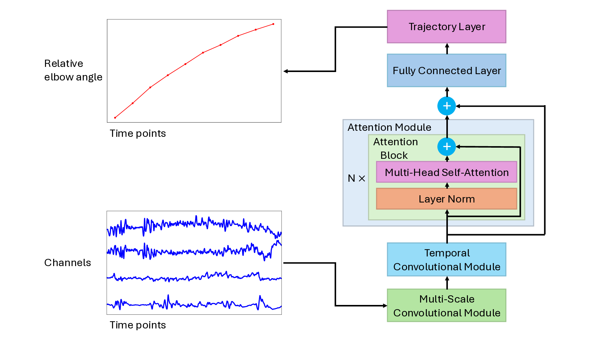

# IDMS — Uncertainty-Aware sEMG-to-Trajectory Intent Estimation

Predicting near-future **elbow-angle trajectories** from surface electromyography
(sEMG), with statistical residual modelling and predictive uncertainty.

Core code for the MSc thesis *"Residual Modelling and Uncertainty-Aware
sEMG-to-Trajectory Intent Estimation"* (T. K. Celebi, 2025).

## Overview

The project implements a TCANet-IDMS model that:

- extracts features from 4-channel EMG with multi-scale CNNs,
- captures temporal dynamics with causal dilated convolutions,
- predicts trajectory parameters with transformer attention, then maps them
  through a differentiable critically-damped IDMS layer into a trajectory, and
- analyses the prediction residuals with ARMA-GARCH-t models and quantifies
  predictive uncertainty (aleatoric + epistemic).

It is organised around the thesis's three contributions:

1. **Intent estimator** — TCANet → `[vd, c1, a0]` → trajectory layer.
2. **Residual modelling** — ARMA-GARCH-t on the estimator residuals.
3. **Uncertainty** — aleatoric (analytical Jacobian) + epistemic (MC-dropout).

## Model Architecture



- **Input**: EMG window (4 channels, 1000 samples at 2000 Hz)
- **Feature extraction**: 3-scale CNN (125, 62, 31 sample kernels)
- **Temporal processing**: TCN with exponential dilation
- **Attention**: multi-head transformer encoder
- **Output**: 10 trajectory points (0.25 s horizon)

## Project Structure

```
src/idms/
├── common/       metrics · config (DataConfig) · save_load_util
├── data/         generator (windowing) · preproc (EMG filtering)
├── estimator/    C1 — TCANet + differentiable IDMS trajectory layer
│   ├── models/       tcanet.py
│   ├── data/         torch Dataset / DataLoaders
│   └── training/     trainer + main()
├── residuals/    C2 — arma_garch · cache · trial_stats
└── uncertainty/  C3 — model · losses · jacobian · train
scripts/          thin command-line entrypoints (run from repo root)
tests/            pytest suite
```

## Setup

```bash
mamba env create -f environment.yml   # or conda
mamba activate idms
pip install -e .            # runtime (PyTorch, statsmodels, arch, …)
pip install -e ".[dev]"     # + pytest
```

The package installs as `idms` and imports from anywhere
(`from idms.estimator.models.tcanet import create_tcanet_idms_model`).

## Usage

All scripts assume the dataset is at `data/idms_ready_dataset.h5` (see **Data**).

**1. Intent estimator**
```bash
python scripts/train_estimator.py                 # train TCANet
python scripts/compare_training_strategies.py     # pretrain→finetune vs direct
python scripts/calculate_baseline_r2.py           # naive baseline
```

**2. Residual modelling**
```bash
python scripts/extract_pytorch_residuals.py          # residuals from a trained model
python scripts/fit_arma_garch_all_trials.py          # fit ARMA-GARCH-t across trials
python scripts/pytorch_residual_statistical_tests.py # diagnostic test battery
python scripts/create_synthetic_residual_validation.py
```

**3. Uncertainty**
```bash
python scripts/train_uncertainty.py --dataset data/idms_ready_dataset.h5
```

The uncertainty model predicts a mean and log-variance for each of `[vd, c1, a0]`,
propagates the parameter variance to trajectory space via the analytical Jacobian
(aleatoric), and uses MC-dropout at inference (epistemic).

## Data

The pipeline reads a single HDF5 file, `data/idms_ready_dataset.h5`:

```
/subjects/<subject_id>/<trial_id>/emg_data/<channel>   # 1-D array per channel, 2 kHz
                                          /...          # + elbow angle
```

- 5 subjects, 4 EMG channels: biceps, triceps, brachioradialis, extensor carpi ulnaris.
- Windowing and split constants live in `idms.common.config.DataConfig`
  (window 1000, stride 50, delay 0.05 s, horizon 0.25 s, 10 points, test ratio 0.05, seed 42).

The dataset and trained checkpoints are private and not committed — see
`data/README.md`.

## Replicating the thesis result

With a trained checkpoint (`best_model.pt`) and the dataset, the estimator
reproduces test **R² = 0.7982814312**: build the `test` split with the
checkpoint's `model_config`, load the `state_dict`, forward-pass, and compute
`r2_score` on the flattened trajectory points.

## Testing

```bash
pytest
```

## Dependencies

PyTorch 2.8 · NumPy · Pandas · SciPy · StatsModels · ARCH · Matplotlib · h5py.
See `environment.yml` for the complete specification.
